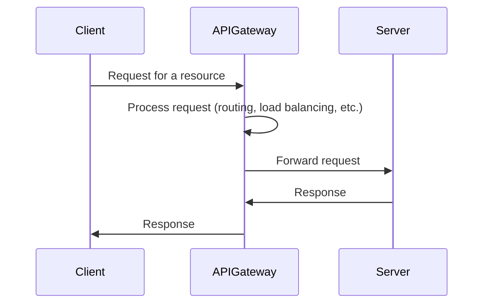

# API Gateway

A simple API gateway written in Go.

## Table of contents

1. [API Gateway](#api-gateway)
2. [Usage](#usage)
   1. [Requirements](#requirements)
   2. [Installing](#installing)
3. [How it works?](#how-it-works)
   1. [Request flow](#request-flow)
4. [Modules](#modules)
   1. [Service discovery](#service-discovery)
   2. [Request routing](#request-routing)
   3. [Load balancing](#load-balancing)
5. [Tasks](#tasks)

## Usage

### Requirements

- Go >= 1.20
- GNU Make 4.3

### Installing

1. Clone the repository

```bash
git clone git@github.com:asynched/api-gateway.git
```

2. Build the binary

```bash
make build
```

## How it works?

The API Gateway is a single entry point for all clients. It is responsible for routing requests to the appropriate service. It also provides additional features such as authentication, rate limiting, caching, etc.

This project implements basic features of an API Gateway, to be used as a learning tool.

### Request flow

When you do a request, your HTTP client sends a header of the host you want to access. The API Gateway uses this header to route the request to the appropriate service. Below is an example of an HTTP request

```
GET / HTTP/1.1
Host: example.com
```

Using this, the API Gateway will route the request to the service(s) that are responsible for the `example.com` host.

The request flow for this project is as follows:



## Modules

### Service discovery

Service discovery is the process of finding the IP address and port of a service. This is done by querying a service registry. The service registry is a database that contains the IP address and port of all services. The API Gateway uses this information to route requests to the appropriate service.

The service registry is built in the application (`internal/domain/repositories/server.go`) and throw the API you can add new services to the registry.

The service discovery module works in conjunction with the health check service (`internal/services/health_check.go`), to check if the service is available.

### Request routing

Request routing is the process of routing a request to the appropriate service. This is done by using the host header of the request. The API Gateway uses this header to find the service that is responsible for the host.

The `internal/http/controllers/proxy.go` module is responsible for routing requests to the appropriate service.

### Load balancing

Load balancing is the process of distributing the load across multiple servers. This is done by using a load balancing algorithm. The API Gateway lists all available servers and uses a random algorithm to select a server.

The `internal/http/controllers/proxy.go` module is responsible for load balancing.

## Tasks

- [x] Module: Service discovery
- [x] Module: Request routing
- [x] Module: Load balancing
- [x] Module: Caching
- [ ] Module: Rate limiting
- [ ] Module: Error handling
- [ ] Module: Authentication / Authorization
